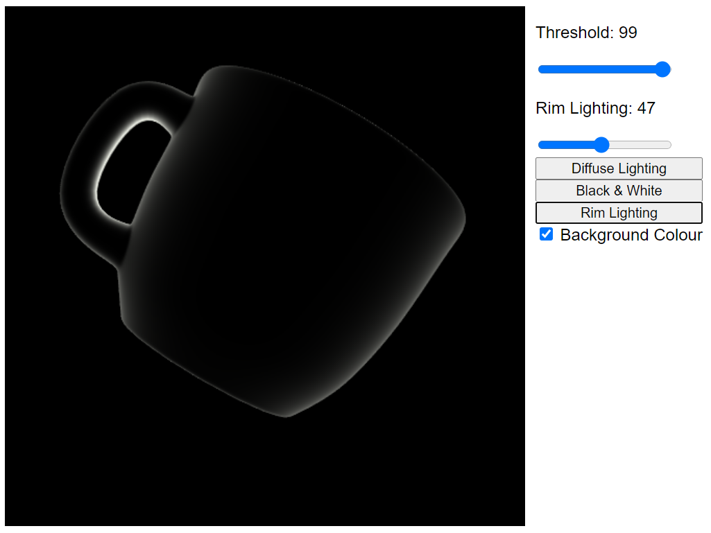

# ToonShader
This is a tool that renders 3D objects in diffuse lighting, rim lighting (backlit) and black and white "ink" shading. This is currently an active project is being developed by Gracie under the advisory of Craig Kaplan.

Demo:
https://graciexia8.github.io/ToonShader/

